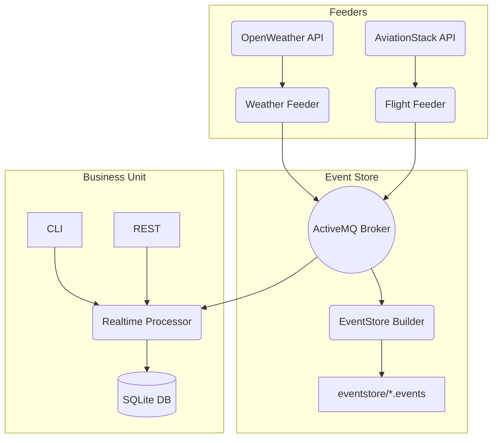

# SkySync – Sistema de Correlación entre Clima y Retrasos de Vuelos en Canarias

SkySync es una plataforma de análisis de datos en tiempo real y diferido que correlaciona condiciones meteorológicas con el estado de los vuelos en los aeropuertos de Canarias. Utiliza las APIs de OpenWeatherMap y AviationStack para recolectar datos en tiempo real, los publica en un sistema de mensajería ActiveMQ, y permite su análisis mediante una línea de comandos y una API REST.

El sistema está estructurado en módulos independientes por funcionalidad, siguiendo arquitectura hexagonal y principios SOLID.

## 🔗 Justificación de APIs y Datamart

- **OpenWeatherMap**: Proporciona datos climáticos actuales, esenciales para evaluar el impacto del clima en vuelos.
- **AviationStack**: Permite monitorizar en tiempo real el estado de vuelos en los aeropuertos canarios.

Los eventos recolectados se almacenan tanto en archivos `.events` como en una base de datos SQLite, permitiendo análisis históricos y procesamiento en tiempo real. Se implementa un datamart con dos tablas: `clima_datamart` y `vuelos_datamart`.

## 🧱 Principios y patrones aplicados

- **Arquitectura hexagonal**: Separación clara entre lógica de dominio, puertos e infraestructura.
- **SOLID**: Servicios de aplicación independientes, adaptadores desacoplados, y uso extensivo de interfaces.
- **Publisher/Subscriber**: Implementado mediante ActiveMQ para desacoplar feeders y procesamiento.
- **Persistencia desacoplada**: SQLite y archivos `.events` actúan como fuentes accesibles por módulos distintos.

## 🏗️ Arquitectura del sistema



## 📦 Estructura por módulos

```
SkySync/
├── skysync-core/               # Modelos de dominio, puertos, eventos (reutilizable)
├── skysync-feeder-weather/     # Recolector de clima (OpenWeather)
├── skysync-feeder-flights/     # Recolector de vuelos (AviationStack)
├── skysync-event-store-builder/ # Almacenamiento de eventos en disco
└── skysync-business-unit/      # Procesamiento y explotación (REST, CLI, servicios)
```

## 🚀 Instrucciones para compilar y ejecutar

Desde la raíz del proyecto (donde está el `pom.xml` principal):

```bash
# 1. Compilar todo el sistema
mvn clean install

# 2. Lanzar el Event Store
cd skysync-event-store-builder
mvn exec:java -Dexec.mainClass="com.skysync.eventstore.Main"

# 3. Lanzar el procesamiento en tiempo real
cd ../skysync-business-unit
mvn exec:java -Dexec.mainClass="com.skysync.adapters.in.cli.SkySync"  # y seleccionar opción 6

# 4. Ejecutar los feeders
cd ../skysync-feeder-weather
mvn exec:java -Dexec.mainClass="com.skysync.feederweather.Main"

cd ../skysync-feeder-flights
mvn exec:java -Dexec.mainClass="com.skysync.feederflights.Main"

# 5. Iniciar API REST (opcional)
cd ../skysync-business-unit
mvn exec:java -Dexec.mainClass="com.skysync.adapters.in.rest.SkySyncRestServer"
```

⚠️ Asegúrate de tener configuradas las siguientes variables de entorno o en `application.properties`:

- `OPENWEATHER_API_KEY`
- `AVIATIONSTACK_API_KEY`

## 📌 Ejemplos de uso

### CLI (SkySync.java)

- Opción `2`: Generar informe diario
- Opción `3`: Predecir probabilidad de cancelación por clima
- Opción `7` a `11`: Análisis climáticos y alertas combinadas

### REST API

Base URL: `http://localhost:7000`

```
GET /informe?fecha=2025-05-15
GET /prediccion?codigo=TFN
GET /clima/promedio
GET /clima/extremos
GET /vuelos/estado
GET /alerta/combinada
```

### Archivos generados

- `eventstore/prediction.Weather/feederA/YYYYMMDD.events`
- `eventstore/prediction.Flight/feederB/YYYYMMDD.events`

### Bases de datos

- `clima_datamart.db`
- `vuelos_datamart.db`

## 👨‍💻 Autor

Desarrollado por **Raúl Mendoza**  **Yain Estrada**
Grado en Ciencia e Ingeniería de Datos – Proyecto académico 2025
