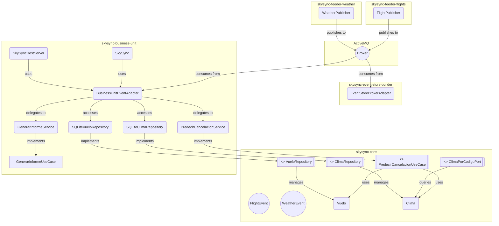
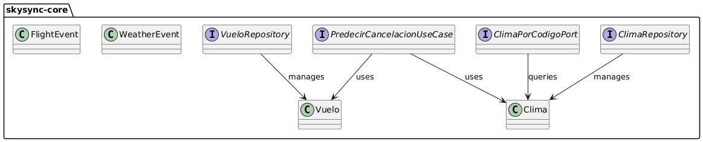
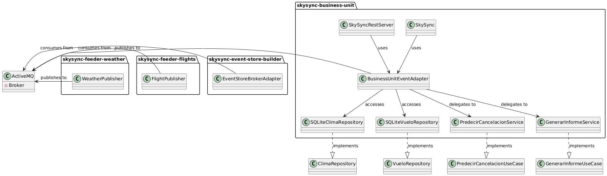

# SkySync  Sistema de Correlacin entre Clima y Retrasos de Vuelos en Canarias

SkySync es una plataforma de anlisis de datos en tiempo real y diferido que correlaciona condiciones meteorolgicas con el estado de los vuelos en los aeropuertos de Canarias. Utiliza las APIs de OpenWeatherMap y AviationStack para recolectar datos, los publica en ActiveMQ, y permite anlisis mediante CLI y API REST. **SkySync ayuda a aeropuertos y pasajeros a anticipar y mitigar disrupciones climticas.** ()

El sistema está estructurado en mdulos independientes, siguiendo arquitectura hexagonal y principios SOLID.

##  Justificacin de APIs y Datamart

- **OpenWeatherMap**: Proporciona datos climticos actuales, esenciales para evaluar el impacto del clima en vuelos.
- **AviationStack**: Monitoriza en tiempo real el estado de vuelos en aeropuertos canarios.
- **Datamart**: Usa SQLite (`clima_datamart`, `vuelos_datamart`) para anlisis histricos y `.events` para portabilidad y acceso modular.

SQLite y archivos `.events` fueron elegidos por su simplicidad, portabilidad y compatibilidad con entornos acadmicos.

##  Principios y patrones aplicados

- **skysync-feeder-weather/flights**: Inyección independiente  para clientes API; Single Responsibility para recolección.
- **skysync-event-store-builder**: Open/Closed para manejar nuevos tipos de eventos; persistencia desacoplada.
- **skysync-business-unit**: Arquitectura hexagonal para separar lgica de dominio; SOLID para servicios REST/CLI.
- **General**: Publisher/Subscriber para ActiveMQ; interfaces para extensibilidad.

##  Arquitectura del sistema



### Arquitectura de la aplicacin (Ejemplo: Business Unit)
- **Puertos**: Interfaces para CLI, REST, y almacenamiento.
- **Adaptadores**: Implementaciones para SQLite, ActiveMQ, y endpoints REST.
- **Dominio**: Servicios para informes, predicciones, y alertas.

### Dominio y Puertos (skysync-core)
Este diagrama muestra los modelos de dominio y los puertos definidos en el ncleo del sistema, siguiendo la arquitectura hexagonal.



### Unidad de Negocio y Adaptadores (skysync-business-unit)
Este diagrama muestra cmo la unidad de negocio interacta con adaptadores, repositorios y mdulos externos, integrndose con ActiveMQ para el procesamiento de eventos.


##  Estructura por mdulos


```
SkySync/
 skysync-core/               # Modelos de dominio, puertos, eventos
 skysync-feeder-weather/     # Recolector de clima
 skysync-feeder-flights/     # Recolector de vuelos
 skysync-event-store-builder/ # Almacenamiento de eventos
 skysync-business-unit/      # Procesamiento y explotacin
```

##  Datos de ejemplo
- **Event Store**: `eventstore/sample/YYYYMMDD.events` (muestra del 15/05/2025).
- **Datamart**: `datamart/sample/clima_datamart.db`, `vuelos_datamart.db`.

##  Instrucciones para compilar y ejecutar

1. **Requisitos previos**:
    - Instala ActiveMQ: [Descargar](https://activemq.apache.org/components/classic/download/) y ejecuta `bin/activemq start`.
    - Configura `OPENWEATHER_API_KEY` y `AVIATIONSTACK_API_KEY` in `skysync-business-unit/src/main/resources/application.properties`.

2. **Compilar** (desde la raz):
   ```bash
   mvn clean install
   ```

3. **Lanzar Event Store**:
   ```bash
   cd skysync-event-store-builder
   mvn exec:java -Dexec.mainClass="com.skysync.eventstore.Main"
   ```

4. **Lanzar Business Unit**:
   ```bash
   cd ../skysync-business-unit
   mvn exec:java -Dexec.mainClass="com.skysync.adapters.in.cli.SkySync"  # Opcin 6 para tiempo real
   ```

5. **Ejecutar Feeders**:
   ```bash
   cd ../skysync-feeder-weather
   mvn exec:java -Dexec.mainClass="com.skysync.feederweather.Main"
   cd ../skysync-feeder-flights
   mvn exec:java -Dexec.mainClass="com.skysync.feederflights.Main"
   ```

6. **Iniciar API REST** (opcional):
   ```bash
   cd ../skysync-business-unit
   mvn exec:java -Dexec.mainClass="com.skysync.adapters.in.rest.SkySyncRestServer"
   ```

Archivos de configuracin estn en `*/src/main/resources/`.


### REST API
URL para el UI: `http://localhost:7000/ui/SkySyncWeb.html`


##  Autores
Desarrollado por **Ral Mendoza Peña** y **Yain Estrada Domínguez**.  
Grado en Ciencia e Ingeniera de Datos  Proyecto acadmico 2025. Ingeniería de Datos – Proyecto académico 2025.